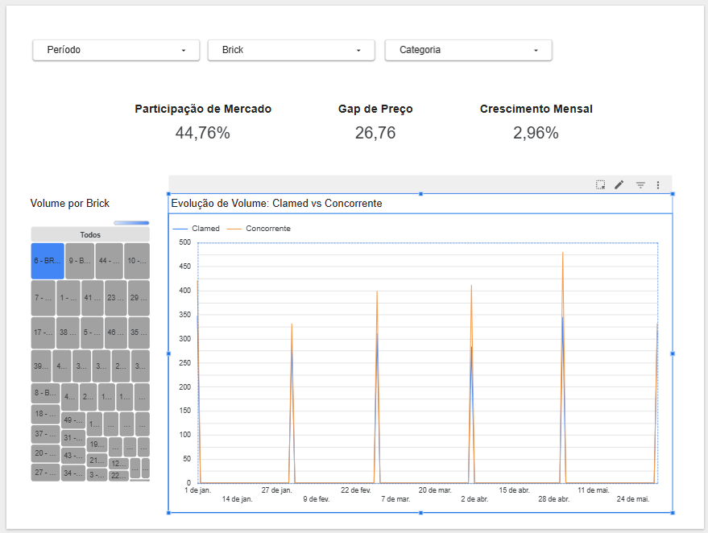

# Projeto ETL de Vendas com Arquitetura Medallion | DEVinHouse CLAMED

## Sobre o Projeto

Este projeto implementa uma solução analítica para processamento e consumo de dados de vendas com arquitetura Medallion simulada, combinando pipeline ETL modular, modelagem analítica em PostgreSQL e dashboard executivo para suporte à decisão comercial.

O contexto DEVinHouse | CLAMED serviu como cenário de negócio para desenvolvimento da solução.

### Problema de negócio
Desafios relacionados a volume crescente de dados, expansão regional e necessidade de visibilidade competitiva exigem uma estrutura analítica capaz de organizar dados, gerar indicadores estratégicos e apoiar decisões comerciais.

O projeto propõe uma solução estruturada para:
- integrar dados de vendas e dimensões de negócio;
- organizar o processamento em camadas analíticas;
- disponibilizar indicadores estratégicos em dashboard executivo.

### Objetivo
Construir um pipeline ETL modular com arquitetura Medallion simulada (Bronze, Silver e Gold), armazenando e transformando dados em PostgreSQL para consumo em dashboard analítico no Looker Studio.

---

# Arquitetura da Solução

O projeto adota uma implementação baseada em arquitetura Medallion, simulando separação de camadas Bronze, Silver e Gold em ambiente relacional.

## Bronze — Dados Brutos
Camada de ingestão dos arquivos fonte em formato CSV, preservando os dados originais.

Responsabilidade:
- extração dos dados de origem
- preservação do dado bruto
- ponto inicial do pipeline

---

## Silver — Tratamento e Integração
Camada responsável por padronização e qualidade dos dados.

Processos realizados:
- limpeza e tratamento
- padronização de colunas
- tipagem
- remoção de inconsistências e duplicidades
- integração de fatos e dimensões em PostgreSQL

---

## Gold — Camada Analítica
Camada orientada ao consumo analítico via view:

`vw_market_share`

Responsável por:
- agregações de negócio
- cálculo de KPIs
- base para exploração no dashboard

---

## Consumo Analítico
A camada Gold alimenta dashboard construído em Looker Studio para exploração interativa dos indicadores.

Fluxo completo:

Dados brutos → Bronze → Silver → Gold → Dashboard

---

# Stack Utilizada

- Python  
- Pandas  
- PostgreSQL  
- SQLAlchemy  
- Looker Studio  
- Git / GitHub

---

# Estrutura do Repositório

```text
projeto-etl-vendas/
│
├── data/raw/                 # arquivos fonte
├── src/
│   ├── extract.py            # extração
│   ├── transform.py          # transformações
│   ├── load.py               # carga em PostgreSQL
│   ├── config.py             # configurações
│   └── utils.py              # funções auxiliares
│
├── sql/
│   └── vw_market_share.sql   # view analítica Gold
│
├── docs/
│   └── img/
│       └── dashboard_v1.png  # evidência visual do dashboard
│
├── logs/
│   └── etl.log               # logs do pipeline
│
├── main.py
├── requirements.txt
└── README.md
```

---

# Pipeline ETL

Fluxo implementado:

## 1. Extract
Leitura dos arquivos fonte.

## 2. Transform
Tratamento, integração e preparação dos dados.

## 3. Load
Carga das tabelas analíticas em PostgreSQL.

## 4. Gold
Construção da view analítica com KPIs.

## 5. Dashboard
Consumo dos indicadores no Looker Studio.

Execução centralizada:

```bash
pip install -r requirements.txt
python main.py
```

---

# Modelagem e KPIs

A camada Gold suporta os seguintes indicadores:

## Participação de Mercado
Mede participação da CLAMED frente ao mercado concorrente.

---

## Gap de Preço
Compara posicionamento de preço em relação à concorrência.

---

## Crescimento Mensal (MoM)
Evolução mensal dos resultados.

---

## Potencial por Brick
Análise de oportunidade por Brick, utilizada como proxy analítica de potencial (não modelo preditivo).

---

# Dashboard Analítico

Dashboard estruturado em narrativa executiva:

## Visão Geral
- KPIs consolidados
- leitura executiva dos indicadores

## Oportunidade
- análise de potencial por Brick
- gaps competitivos

## Evolução
- comportamento temporal dos indicadores

### Filtros disponíveis
- Período
- Brick
- Categoria

## Evidência Visual do Dashboard

Visão consolidada do dashboard analítico desenvolvido:



---

# Entregas da Solução

A solução entrega as seguintes capacidades:

- Pipeline analítico modular para integração, transformação e carga de dados
- Arquitetura Medallion aplicada em estrutura simulada de camadas Bronze, Silver e Gold
- Camada Gold analítica para geração e consumo de indicadores estratégicos
- Dashboard executivo interativo para suporte à decisão comercial
- Operacionalização de KPIs de mercado e identificação de oportunidades por Brick
- Monitoramento operacional do pipeline por logging do processo ETL
- Versionamento e rastreabilidade técnica via Git/GitHub

---

# Validações e Decisões Técnicas

## Integridade e qualidade
Foram aplicadas verificações de:
- consistência entre fontes
- limpeza e padronização
- integridade de relacionamentos
- coerência dos agregados analíticos

## Decisões de modelagem
Principais decisões:
- uso de arquitetura Medallion simulada
- PostgreSQL como camada persistente analítica
- Gold modelada como view para consumo BI
- modelagem orientada a indicadores de negócio

---

# Como Executar

## Pré-requisitos
- Python instalado
- PostgreSQL configurado
- dependências do projeto

## Passos

1. Clonar repositório

```bash
git clone <repo_url>
```

2. Instalar dependências

```bash
pip install -r requirements.txt
```

3. Executar pipeline

```bash
python main.py
```

4. Consultar view analítica e consumir no dashboard.

---

# Evoluções Futuras

Possíveis evoluções:
- automação de cargas incrementais
- ampliação de monitoramento e observabilidade
- expansão dos indicadores analíticos
- evolução para ambiente cloud real

---